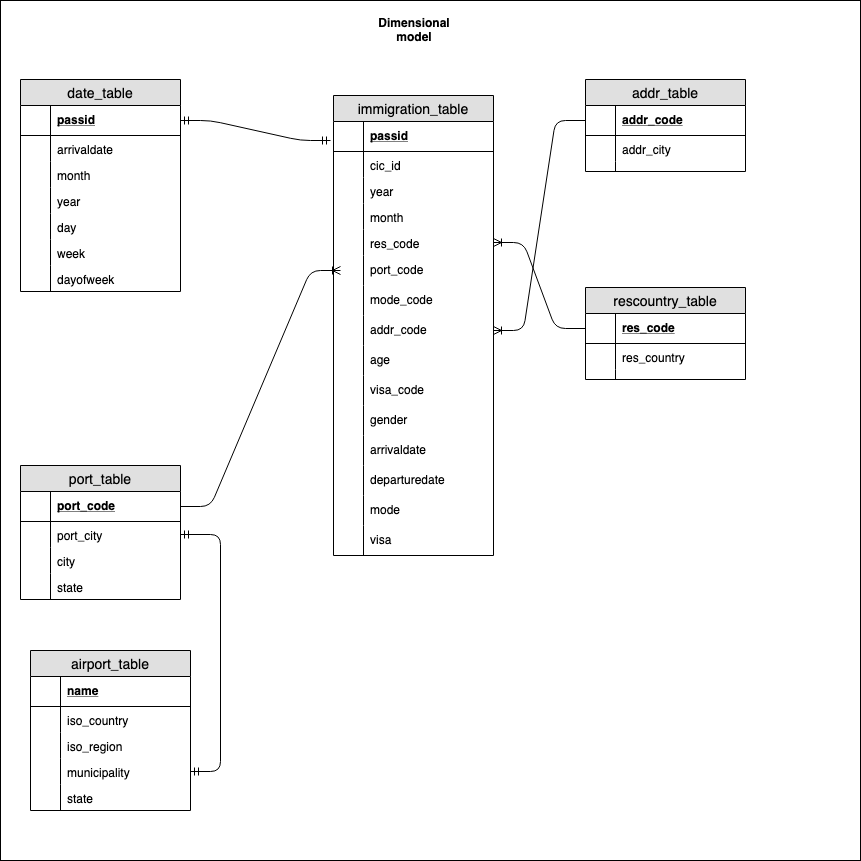

## Overview: Design and build SPARK ETL pipeline to analyse US immigration data during school summer break of the year

### Scope: Build data model that can be used by airport authorities, agencies and travellers to get data insights on number of tourists, airport busy days, and information about immigrants. Use Pyspark to extract data from s3 data lake and perform ETL.

### Beow data sets are used to build data model
I94 Immigration Data: This data comes from the US National Tourism and Trade Office. July and August month data is used for the analysis.
Airport Code Table: This contains airport codes, names and cities of the world.
Codes Data: Below files are used contains code values that are used in I94 Immigration Data.
I94PORT: contains port codes and corresponding values
I94ADDR: contains arrival city codes and corresponding values
I94RES: contains resident country codes and corresponding values

### ETL
### process_immigration_data: 
This function processes the immigration data for the July and August month and writes transformed data to parquet files
#### immistaging_table
This table contains raw data read from the data lake
Transformation used: 
*Update depdate column value with 0 if it is null otherwise keep as it is.
*Apply get_date function to convert SAS date format to 'YYYY-MM-DD' on columns arrivaldate and departure date

#### immigration_table
This is a fact table and contains immigrant details
Transformation used: 
*Extract data from immistaging_table table and update visa and mode codes with values

#### date_table
This is a dimension table and conatins date data
Transformation used: 
*Extract data from immistaging_table table and update visa and mode codes with values

### process_code_data
This function processes the codes data files and writes transformed data to parquet files.
#### port_table
This is a dimension table that contains port codes and city
Transformation used: 
*Columns are renamed to meaningful names and dataype for code is converted to integer

#### addr_table
This is a dimension table that contains arrival city codes and city names
Transformation used: 
*Columns are renamed to meaningful names and dataype for code is converted to integer

#### rescountry_table
This is a dimension table that contains immigrant resident country codes and country names
Transformation used: 
*Columns are renamed to meaningful names and dataype for code is converted to integer

#### airport_table
This is a dimension table that contains airport codes and city names.
Transformation used: 
*Columns are renamed to meaningful names, data is filtered for country 'US', and column iso_region is split by state.

### Dimensional model

### Data dictionary

1. immigration_table.parquet: 

| Field             | Data Types    | Description                   |
|-------------------|---------------|-------------------------------|
| passid            | long          | sequential id - surrogate key |
| cic_id            | long          | system generated id           |
| year              | integer       | year of arrival               |
| month             | integer       | month of arrival              |
| res_code          | integer       | resident country code         |
| port_code         | string        | airport code                  |       
| mode_code         | integer       | travel mode code              |         
| addr_code         | string        | arrival city code             |         
| age               | double        | age of the immigrant          |
| visa_code         | double        | visa type code                |
| gender            | string        | gender of the immigrant       |
| arrivaldate       | timestamp     | arrival date                  |  
| departuredate     | timestamp     | departure date                |
| mode              | string        | travel mode description       |
| visa              | string        | visa type description         | 

2. date_table

| Field             | Data Types    | Description                   |
|-------------------|---------------|-------------------------------|
| passid            | long          | sequential id - surrogate key |
| arrivaldate       | timestamp     | date of arrival               |
| month             | integer       | month of arrival              |                        
| year              | integer       | year of arrival               |
| day               | integer       | day of arrival                |
| week              | integer       | week of the year              |       
| dayofweek         | integer       | day of the week               |         

3. port_table

| Field             | Data Types    | Description                       |
|-------------------|---------------|-----------------------------------|
| port_code         | string        | code of airport                   |
| port_city         | string        | city with state code              |
| city              | string        | city                              |                          
| state             | string        | state                             |
   

4. addr_table

| Field             | Data Types    | Description                       |
|-------------------|---------------|-----------------------------------|
| addr_code         | string        | arrival city code                 |
| addr_city         | string        | arrival                           |                          

      
5. rescountry_table

| Field             | Data Types    | Description                       |
|-------------------|---------------|-----------------------------------|
| res_code          | integer       | resident country code             |
| res_country       | string        | resident country                  |   

6. airport_table

| Field             | Data Types    | Description                       |
|-------------------|---------------|-----------------------------------|
| name              | string        | airport name                      |
| iso_country       | string        | airport country code              |
| iso_region        | string        | airport regiom                    |                          
| municipality      | string        | airport municipality              |
| state             | string        | airport state                     |

