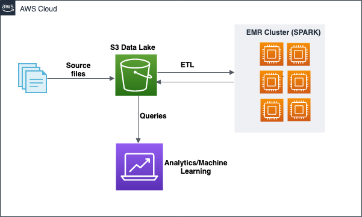
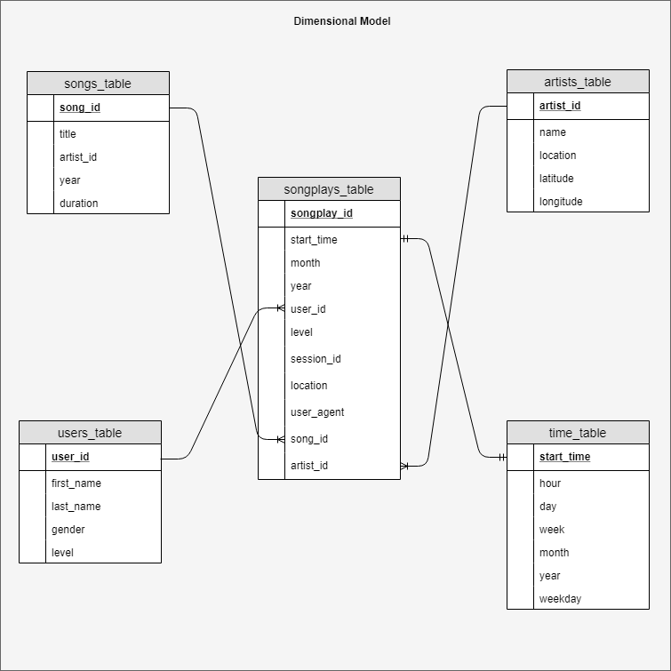

# Data Lake and Spark ETL Documentation

## Overview: Design and build Spark ETL pipeline and transform data to help analytical team build marketing products based on user listening interests in songs and artists

This document comprises of below parts

1. ETL Pipeline 
2. Extracting, loading and transforming data from s3
3. Writing data to s3

## ETL Pipeline 

## Dimensional model 

## Extract, load and transform data from s3

Data is stored on Amazon s3 cloud and consists of songs and logs data. Below ETL python functions are used to connect to s3, extract data and load it into data frames to transform data further.

#### create_spark_session
This function creates Spark session to be used by other functions to read and process data from s3.

#### process_song_data
This function uses spark session function to connect to s3, extract and load data into below data frames
1. df: The data is read from song data files on s3 and loaded into this data frame to be processed further.

2. songs_table: Data is extracted for song_id, title, artist_id, year and duration columns from 'df' data frame and is loaded into songs_table. Rows having null values for 'song_id' field and duplicate records are removed.

3. artists_table: Data for fields artist_id, name, location, latitude and longitude are extracted and loaded into artists_table data frame. Rows having null values for 'artist_id' field and duplicate records are removed. 'withColumnRenamed' transformations are applied on data frame columns artist_name, artist_location, artist_latitude, artist_longitude to columns name, location, latitude, longitude respectively.

#### process_log_data
This function uses spark session function to connect to s3, extract and load data into below data frames
1. df: The data is read from log data files on s3 and loaded into this data frame. Data is filtered on 'page==Nextsongs' and 'userID' having blank records are removed.

2. users_table: Data for user_id, first_name, last_name, gender, level fields are extracted from 'df' data frame. Rows having null values for 'user_id' field and duplicate records are removed. 'withColumnRenamed' transformations are applied on data frame columns UserId, firstName, lastName to columns user_id, firstName, lastName respectively. The data type for user_id field is changed from string to long.

3. get_timestamp: This is a udf function to convert the time into seconds and extract date in the format yyyy/MM/dd using built in 'strftime' function. A new column 'timestamp' is derived by applying this function on field 'ts' of data frame df.

4. get_datetime: This is a udf function to extract datetime as a timestamp data type using built in 'TimestampType' function. A new column 'datetime' is derived by applying this function on field 'ts' of data frame df.

5. time_table: Fields start_time, hour, day, week, month, year, weekday is extracted from datetime field of df data frame by applying built-in functions year, month, dayofmonth, hour, weekofyear and dayofweek.

6. song_df: Data from df data frame is extracted for fields timestamp, datetime, month, year, user_id, level, song_id, artist_id, session_id, location and user_agent. Data is filtered on 'page==Nextsongs' and userID datatype is converted to long. Fields datetime, userID, sessionId, userAgent are renamed to start_time, user_id, session_id and user_agent. New fields month and year are derived from timestamp field of df data frame.

7. songplays_table: This data frame is derived by joining tables songs_table, artists_table and song_df.

## Save Data Frame as parquet file in s3
Once the data has been loaded into data frame and transformed, data frames are stored in s3 as parquet files for querying and analysis. Below are the parquet files details saved in s3.

1. songs_table.parquet: Data from songs_table data frame is saved as songs_table.parquet and is partitioned by columns year and artist_id. Below is its schema.

| Field             | Data Types   |
|-------------------|--------------|
| song_id           | string       |
| title             | string       |
| artist_id         | string       |
| year              | long         |
| duration          | double       |

2. artists_table.parquet: Data from artists_table data frame is saved as artists_table.parquet. Below is its schema.

| Field             | Data Types   |
|-------------------|--------------|
| artist_id         | string       |
| name              | string       |
| location          | string       |
| latitude          | double       |
| longitude         | double       |

3. users_table.parquet: Data from time_table data frame is saved as users_table.parquet. Below is its schema.

| Field             | Data Types    |
|-------------------|---------------|
| user_id           | long          |
| first_name        | string        |
| last_name         | string        |
| gender            | string        |
| level             | string        |

4. time_table.parquet: Data from time_table data frame is saved as time_table.parquet. Below is its schema.

| Field             | Data Types   |
|-------------------|--------------|
| start_time        | timestamp    |
| hour              | integer      |
| day               | integer      |
| week              | integer      |
| month             | integer      |
| year              | integer      |
| weekday           | integer      |

5. songplays_table.parquet: Data from songplays_table data frame is saved as songplays_table.parquet. Below is its schema.

| Field             | Data Types   |
|-------------------|--------------|
| songplay_id       | long         |
| start_time        | timestamp    |
| month             | integer      |
| year              | integer      |
| user_id           | long         |
| level             | string       |
| session_id        | long         |
| location          | string       |
| user_agent        | string       |
| song_id           | string       |
| artist_id         | string       |

