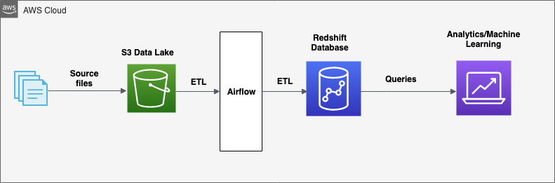

# Data Pipelines with Airflow

## Overview: Automate and monitor data Warehouse ETL pipelines using Apache Airflow and do data quality check to catch any  discrepancies in the datasets. 

This document contain design details of Apache Airflow ETL pipeline.
1. ETL Pipeline
2. DAG definition 
3. Tasks

## ETL Pipeline

## DAG definition
Defines and instantiate DAG using below Default arguments and schedules it to run hourly.
owner
depends_on_past
start_date
retries
email_on_retry
retry_delay
catchup

## Task
### start_operator
This is a dummy operator to indicate the beginning of ETL process

### stage_events_to_redshift
This tasks loads staging_events table in redshift database from S3 data lake by using custom operator 'StageToRedshiftOperator' 

### stage_songs_to_redshift
This task loads data into staging_songs table from s3 using operator 'StageToRedshiftOperator'

### load_songplays_table
This task loads data into songplays_fact_table fact table from staging_songs and staging_events table using operator 'LoadFactOperator'. Transformation is applied on ts column to get date time value. Data is filtered on page column for value 'NextSong'.

### load_user_dimension_table
This task loads user dimension table from staging_events table using operator 'LoadDimensionOperator'. Data is filtered on page column for value 'NextSong'.

### load_song_dimension_table'
This task loads songs dimension table from staging_songs table using operator 'LoadDimensionOperator'. Transformation is applied to remove duplicate songid records.

### load_artist_dimension_table
This task loads artists dimension table from staging_songs table using operator 'LoadDimensionOperator'. Transformation is applied to remove duplicate artistid records.

### load_time_dimension_table
This task loads data into time dimension table from songsplay fact table using operator 'LoadDimensionOperator'. Transformation is applied on start_time column to extract hour, day, week, month, year and day of week.

### run_quality_checks
This task checks the data quality to find any discrepancies in data sets using operator 'DataQualityOperator'.

### end_operator
This is a dummy operator to indicate the end of ETL process

## Operator
### StageToRedshiftOperator
This is a dynamic operator to copy data from s3 storage to staging tables. The operator takes in parameters - s3 path, table and credentials and logs info before after the data copy.

### LoadFactOperator
This is a dynamic operator to copy data from staging tables to fact table. The operator takes in parameters - redshift connection credentials, table insert query and logs info before after the data load.

### LoadDimensionOperator
This is a dynamic operator to copy data from staging and fact tables to dimensions tables. The operator takes in parameters - redshift connection credentials, table name, table insert query and logs info before after the data load.

### DataQualityOperator
This is a dynamic operator to check data quality issues on final data sets. The operator takes in parameters - redshift connection credentials and table name and logs info before after the data load.

## Task dependencies
Defines the ETL task sequence. Certain tasks are run in parallel to reduce the ETL process run time.